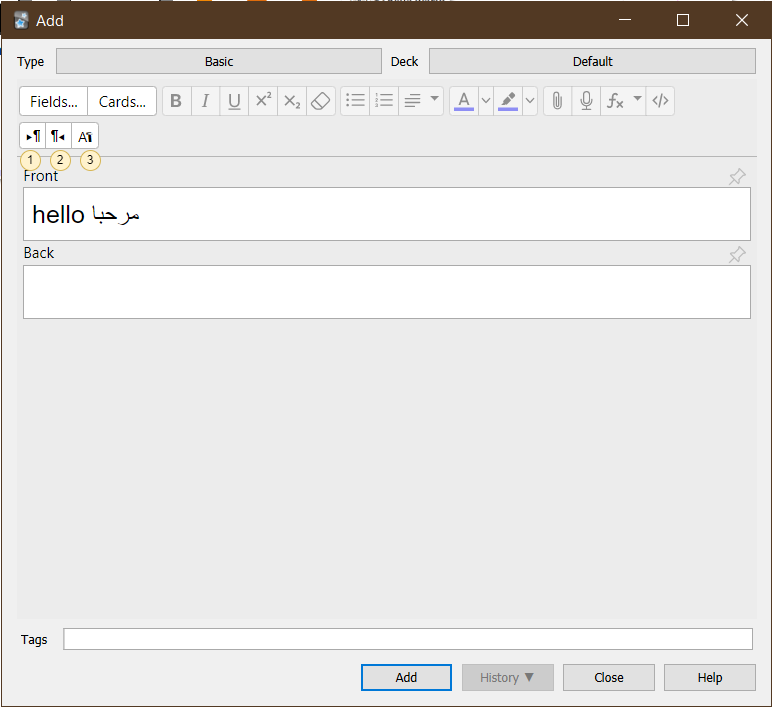

# BiDi Tools For Anki

An add-on for [Anki](https://apps.ankiweb.net/) that adds some editor tools for
[bidirectional text](https://en.wikipedia.org/wiki/Bidirectional_text)
(BiDi)—text containing different types of alphabets that have different
[directionalities](https://en.wikipedia.org/wiki/Writing_system#Directionality) (e.g. mixed English and Arabic text).

Anki already provides an option to set each field's direction under the Fields screen,
and modern systems do a decent job handling mixed text thanks to the [Unicode Bidirectional Algorithm](https://unicode.org/reports/tr9/),
but there are cases when it's necessary to explicitly specify the direction of certain parts
of the field text because of limitations in what the algorithm can do automatically.

## BiDi Intro

You can read some incomplete notes I've written about the BiDi algorithm in [technical.md](./technical.md)

## Usage

The add-on provides buttons to set the direction of the selected text to either LTR
(left to right, like the Latin script and most scripts), or RTL (right to left,
like in Arabic, Hebrew, Persian, etc.)

The following actions are available in the editor:
1. **Left-To-Right**: Apply left-to-right direction to the [HTML block element](https://developer.mozilla.org/en-US/docs/Web/HTML/Block-level_elements)
  surrounding the selected text (if any). If you're not familiar with HTML, you can think of this as roughly setting the direction
  of the entire line where the cursor is currently at.
2. **Right-To-Left**: Ditto, but for RTL.
3. More options under the third icon:
   - **LTR Selected**: Apply left-to-right to direction to the selected text only.
   - **RTL Selected**: Ditto, but for RTL.
   - **Insert Characters**: A menu for inserting common Unicode characters used to affect text directionality.
     You probably don't need to use any of these as the previous options should cover most cases,
     but see <https://en.wikipedia.org/wiki/Bidirectional_text#Unicode_bidi_support> for an explanation of the characters.

## AnkiWeb

You can download the add-on from AnkiWeb: <https://ankiweb.net/shared/info/281067366>

## Translations

The add-on is localized to English and Arabic. You can help translate the add-on to your langauge
and send me the translated strings and I will include them (or you can open a PR if you're technical).
There are only a few strings to translate. See [i18n.py](./src/i18n.py) for a list of the strings
and how they are defined for each language.

## Support me

Consider supporting me on Ko-fi or Patreon if you like my add-ons:

 

I'm also available for freelance add-on development at Fiverr:

