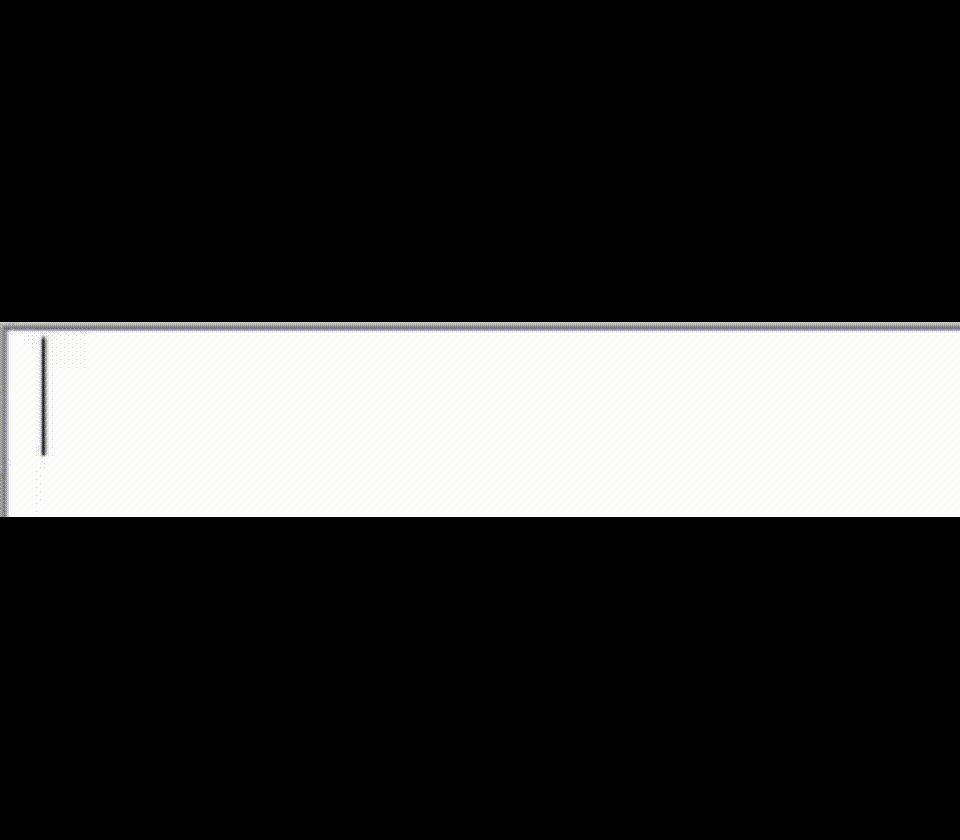
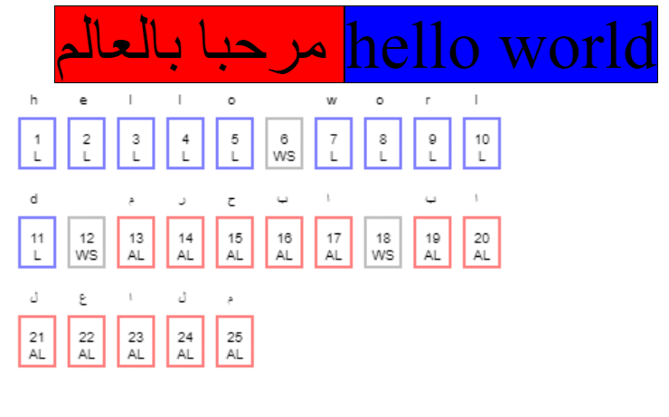
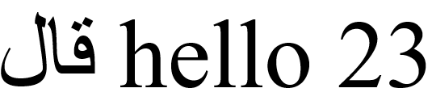
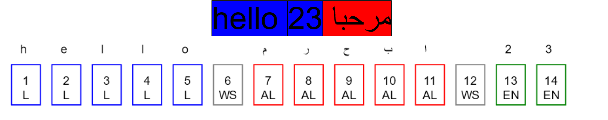
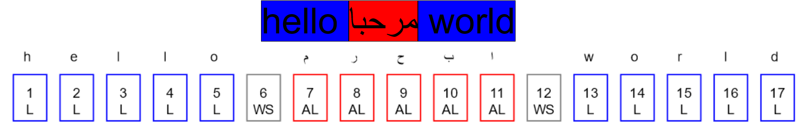

# BiDi Tools For Anki

An add-on for [Anki](https://apps.ankiweb.net/) that adds some editor tools for
[bidirectional text](https://en.wikipedia.org/wiki/Bidirectional_text)
(BiDi)—text containing different types of alphabets that have different
[directionalities](https://en.wikipedia.org/wiki/Writing_system#Directionality) (e.g. mixed English and Arabic text).

Anki already provides an option to set each field's direction under the Fields screen,
and modern systems do a decent job handling mixed text thanks to the [Unicode Bidirectional Algorithm](https://unicode.org/reports/tr9/),
but there are cases when it's necessary to explicitly specify the direction of certain parts
of the field text because of limitations in what the algorithm can do automatically.

## BiDi Intro

We will go through some examples of problems with bidirectional text and how to solve them using this add-on,
but before doing that, it's worth understanding some concepts about bidirectional text.

Let's say we want to type the sentence `hello world مرحبا بالعالم` (containing English and Arabic)
in a field configured as left-to-right (the default). This is how one
would normally type such text:

Notice how the Arabic text runs right-to-left (RTL) automatically even though we typed it in a LTR field.
This is thanks to the BiDi algorithm: it knows what characters run LTR and what characters run RTL,
so it rearranges each sequence of characters with the same directionality accordingly. These sequences are called "runs".
The order in which we type the characters is called the logical order, while the order in which
the characters actually appear is called the visual order.

If we type the text in a RTL field instead, the result will be:

The only change is the relative order of each run.

An attentive reader may ask about the spaces separating each word: Are they considered
LTR or RTL characters? They are in fact "neutral characters" that have no inherent directionality
of their own, but instead take the directionality of their context. So, the space between "hello"
and "world" will be considered LTR, while the space between "مرحبا" and "بالعالم" will be RTL.
The space separating the English sentence from the Arabic one will be considered LTR in a LTR field,
and RTL in a RTL field. Many whitespace characters and punctuation marks fall within this category too.

This picture illustrates the directionality of each run of the text where red means RTL and blue means LTR.
The boxes shows how the characters were actually typed; the logical order.
Each character is shown above its box, with its order in the text shown inside the box.
The text inside the boxes ("L", "AL", and "WS") denotes the [BiDi classes](https://unicode.org/reports/tr44/#Bidi_Class_Values) of the characters.
Here "L" denotes left-to-right characters, "AL" denotes Arabic characters, and "WS" denotes whitespace.
The BiDi algorithms assign characters to several classes. These classes can be grouped
into broader categories like "strong" and "neutral".

Let's take another example. We have the meaningless sentence "قال hello 23" in a LTR field.

Let's classify each character by its directionality: The English characters are LTR, the Arabic ones are RTL.
Easy, but what about the digits?

It appears that the digits are treated as LTR here. This makes sense considering
that numbers run LTR both in LTR langauges and RTL ones.

But consider the following two examples:

hello مرحبا 23

hello مرحبا world

Which have the following logical orderings:

We notice that while the digits in the first example are ordered LTR as we expect,
the sequence of the digits as a whole, the run, actually goes to the left of the Arabic word,
as opposed to its right as it's the case for the word "world" in the second example.
So it seems digits are actually different than normal LTR characters: While they run
LTR internally like English letters, their order as a whole relative to other runs can be different.
Here they go to the left of the Arabic word as an Arabic word would do.
If we replaced the Arabic word with an English one, the number will show to the right
of the word as we expect (e.g. "hello goodbye 23").
The digits are actually from a class of characters known as "weak characters".
They are characters that don't have a definite direction, but are influenced by their surroundings.
Weak characters are shown in green boxes above.

This property of numbers and weak characters in general is often where things go messy with BiDi text.
Let's say we want to write the sentence shown in the picture in a LTR context:

If we actually write it in some LTR field, we'll likely get "say مرحبا 3 times" instead.
The number 3 is in the wrong place; we want it displayed
after the Arabic word as it's part of the overall English sentence! But the BiDi algorithm treats it as part
of the RTL run because it comes after a RTL word.
That's a limitation of the algorithm that we have to work around somehow.
If we add a LTR character before 3 we'll get the display we want: "say مرحبا d3 times".
But of course, we won't add random characters in our text
just to get it to display properly!
For this reason the Unicode standard provides us with some
magical characters that solve this problem. Take a look at this text: "say مرحبا ‎3 times".
It's the same example except that I inserted some invisible character that has the effect
of a LTR character while not being visible.
This character is called the Left-To-Right Mark: It functions exactly like a LTR character except that it's has
no visual representation. There is also a Right-To-Left Mark too.
Luckily for us, we mostly don't have to bother with inserting these invisible characters in Anki and Web contexts,
because we can just force the number here to be LTR by wrapping it in some HTML like ``,
which will fix our problem.

[To be continued]

## Usage

The add-on provides buttons to set the direction of the selected text to either LTR
(left to right, like the Latin script and most scripts), or RTL (right to left,
like in Arabic, Hebrew, Persian, etc.)

The following actions are available in the editor:
1. **Left-To-Right**: Apply left-to-right direction to the [HTML block element](https://developer.mozilla.org/en-US/docs/Web/HTML/Block-level_elements)
  surrounding the selected text (if any). If you're not familiar with HTML, you can think of this as roughly setting the direction
  of the entire line where the cursor is currently at.
2. **Right-To-Left**: Ditto, but for RTL.
3. More options under the third icon:
   - **LTR Selected**: Apply left-to-right to direction to the selected text only.
   - **RTL Selected**: Ditto, but for RTL.
   - **Insert Characters**: A menu for inserting common Unicode characters used to affect text directionality.
     You probably don't need to use any of these as the previous options should cover most cases,
     but see <https://en.wikipedia.org/wiki/Bidirectional_text#Unicode_bidi_support> for an explanation of the characters.

## AnkiWeb

You can download the add-on from AnkiWeb: <https://ankiweb.net/shared/info/281067366>

## TODO

- [] Improve my ability to explain things and make the text less confusing.
- [] Add link to my JavaScript BiDi demo when it's finished.
